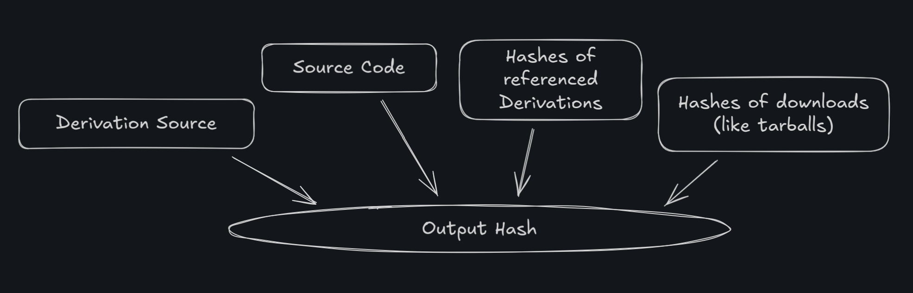

<style>
	section {
		display: flex;
		text-align: start;
	}
	ul {
		margin: 0;
	}
	code {
		tab-size: 3;
	}

	
	img {
		max-width: 100%;
		max-height: 100%;
		height: auto;
		width: auto;
		object-fit: contain;
	}

	p:has(img) {
		flex: 1 1 auto;
		min-height: 0;
		overflow: hidden;
		display: flex;
		align-items: center;
		justify-content: center;
	}
	
	:root {
		--color-background: #d5dcf0ff;
		--color-background-code: #f1f2ffff;
		--color-background-paginate: rgba(128, 128, 128, 0.05);
		--color-foreground: #345;
		--color-highlight: #99c;
		--color-highlight-hover: #aaf;
		--color-highlight-heading: #99c;
		--color-header: #bbb;
		--color-header-shadow: transparent;
		font-size: 24px;
	}
</style>

# Roadmap

- Nix, the language
- Nix, the package manager
- Nix, the OS
- My super special NixOS configuration
- Writing your own NixOS Modules

---

# Non-Goals

- Nix language details
- Secret management
- Third party Nix tools
- Flakes

---

# Nix, the language

Nix is a _lazily evaluated_, _purely functional_, _dynamically typed_ programming language. Any Nix program should evaluate to one value, however complex.

We're just going to scrape the surface.

---

## Let statements

These declare """variables""" to be used in an expression.

```nix
let
	a = 5;
	b = 6;
in
a + b;
# evaluates to 11
```

---

## Attrsets

Nix's version of the _ubiquitous_ key-value object.

```nix
let
	obj = {
		foo = {
			bar = "string";
		}
	}
in
obj.foo.bar;
# evaluates to "string"
```

---

## Functions

```nix
let
	func = x: x + 1;
	num = 4;
in
func num;
# evaluates to 5
```

```nix
let
	func2 = {a, b}: a + b;
in
func2 {a = 100; b = 1;};
# evaluates to 101
```

---

# Nix, The Package Manager

A purely functional language gives us _determinism_. So long as we know and constrain the external inputs, we can make a build system that is _reproducible_ with respect to its source.

<!-- That is, building an application from the same git hash should _always_ produce the same output bit for bit, on any machine. -->

---

## Derivations

Nix packages are built with a _derivation_ - a Nix expression with a building recipe.

It's so built-in there's a keyword for the native type.

```nix
derivation {
  name = "hello-text";
  system = "x86_64-linux";
  builder = "${bash}/bin/bash";
  args = ["-c" "echo hello > $out"];
};
```

---

## Nix Store

That derivation, when built, creates this output in the nix store. Notice it's keyed with a hash!

```bash
$ cat /nix/store/xllvcp640z6lfpvs15kn8i66pv4pkw2w-hello-text
hello source!
```

---

## Derivation Cross-References

Of course a derivation can use other derivations as dependencies, why not. In the derivation we've already seen, we interpolated `${bash}`.

```nix
derivation {
	...
	builder = "${bash}/bin/bash";
}
```

`bash` is built with a derivation too! Let's evaluate it:

```bash
nix-repl> bash
«derivation /nix/store/nwbcgdn1gcv93k78as58dpx61vav23v7-bash-interactive-5.3p3.drv»
```

---

<br/>
The important thing is that the INPUTS are hashed into the output.



---

## Nixpkgs and Hand Waving

- 130k packages
- many programatically expanded
- Neat CI with tests!
- Binary cache
- There's packages ok

---

## Why is this cool?

- Reproducability!
- Hermetic Builds!
- No Dependency Hell!
- Aggressive Caching!
- Chill Rollbacks!

Nix turns package building into a _pure function_.

---

Available on Linux, OSX, and WSL, Nixpkgs has the current largest and freshest collection of packages in existence.


---

# WHY STOP THERE

what if we build a linux distro on these principles?

---

# NixOS, the ...uh... OS

NixOS is a program that takes a configuration _modules_ written in Nix, and merges and evaluates them to build a _system configuration_. It can then apply that configuration to a Linux system.

---

## Modules

Modules are an abstraction specific to _NixOS_. They're a function that takes some environmental stuff and spits out a configuration.

```nix
{config, lib, pkgs, ...}: {
	config = {
		# Enable the COSMIC Desktop Environment.
		services.desktopManager.cosmic.enable = true;
	}
}
```

---

## What can you configure?

There's plenty of high-level options in the `nixpkgs/nixos` repo, but you can also just add packages.

```nix
{ config, lib, pkgs, ... }:
{
	programs.steam.enable = true;
	programs.steam.gamescopeSession.enable = true;
	# ensure these packages are installed on the system
	environment.systemPackages = [
		pkgs.mangohud
		pkgs.protonup-ng
		pkgs.nethack
	];
}
```

---

## Module Options

A module can also define some of its own options in the global config.

```nix
{config, lib, pkgs, ...}: {
	options.mymodule = {
		arbitrariness = lib.mkOption {
			type = lib.types.int;
			default = 1;
			description = "My Option :D";
		};
	};
	config = {
		something = config.mymodule.arbitrariness;
	};
}
```

---

## Module Composition

Here's where it all ties together, modules using other modules with the `imports` section.

```nix
{config, lib, pkgs, ...}: {
	imports = [ ./modules/mymodule.nix ];
	config = {
		mymodule.arbitrariness = 100;
	}
}
```

---

# My Super Special Nixos Configuration

Simplified for the talk, I've built a system of modules that lets me share a configuration repo for _all_ my needs.

---

## Entrypoint

It all starts with the host configuration module, which pulls in any others it might need.

```
hosts
├ hypergamma
| | configuration.nix
| | hardware-configuration.nix
├ goblin
| | configuration.nix
| | hardware-configuration.nix
├ aj-framework
| | configuration.nix
| | hardware-configuration.nix
```

<!-- Hardware configurations are generated at install time. They do things like define the bootloader and mount drives. -->

---

## Entrypoint

Alongside some machine-specific configuration, this module imports plenty of others.

```nix
# hypergamma/configuration.nix
{config, pkgs, flake-inputs, ...}:
{
	imports = [
		./hardware-configuration.nix
		../../users/b/default.nix
		../../modules/nix-settings.nix
		../../modules/amdgpu.nix
		../../modules/gnome.nix
		../../modules/cosmic.nix
		../../modules/gaming.nix
		../../modules/gnupg.nix
		../../modules/flatpak.nix
		../../modules/tailscale.nix
	];
	config = {
		programs.zoom-us.enable = true;
		virtualisation.docker.enable = true;
		...
	};
}
```

---

## User Module

My user-specific modules configure an account and anything that user _always wants around_.

```nix
# users/b/default.nix
users.users.b = {
	isNormalUser = true;
	extraGroups = [ "networkmanager" "wheel" "wireshark"];
	shell = pkgs.zsh;
	packages = [ pkgs.neovim ];
};
home-manager.users.b = {
	programs.zsh = {
		enable = true;
		oh-my-zsh = {
			enable = true;
			theme = "refined";
		};
		shellAliases = {
			nixswitch = ("sudo nixos-rebuild switch --flake ~/nixos#" + userConfiguration.hostname);
		};
	};
};
```

---

## Generic Modules

There's a bunch of these, little reusable bundles of settings grouped by topic.

```
modules
| gaming.nix
| gnome.nix
├ nvidia
| | default.nix
| | vaapi.nix
| amdgpu.nix
| cosmic.nix
| flatpak.nix
| gnupg.nix
| godot-3-libxcrypt.nix
...
```

---

## Custom Modules!

You can even make your own modules with their own options! Here's some abstractions I put together for services running through a tunnel to a VPS:

```nix
# Custom FRP Services
goblin-frpc = {
	enable = true;
	tokenFile = config.age.secrets.frp-token.path;
	services = {
		nextcloud = {
			enable = true;
			package = pkgs.nextcloud32;
			extraApps = with pkgs.nextcloud32Packages.apps; {
				inherit calendar contacts cookbook;
			};
			hostname = "nc.beensoup.net";
			datadir = "/run/media/spinning-rust/nextcloud-data";
			dbPassFile = config.age.secrets.nextcloud-pg-pass.path;
			internalHTTPPort = 8081;
		};
		foundry = {
			enable = true;
			hostname = "foundry.beensoup.net";
			volumePath = "/var/foundryvtt";
			envFile = config.age.secrets.foundry-env.path;
			internalHTTPPort = 8082;
		};
	};
};
```

---

# Live Demo?

I will attempt to install a package, LIVE.

<!-- use marp-cli, the tool used to generate these slides :) -->

---

# Questions
